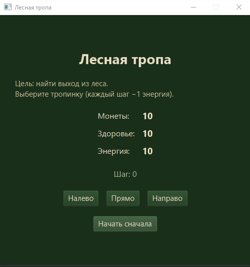
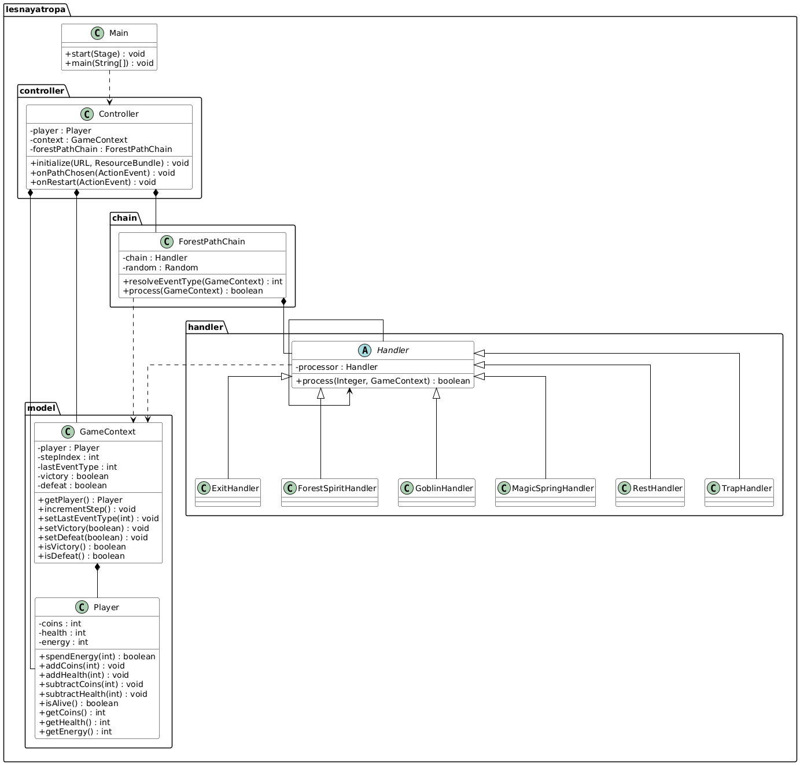

# Лесная тропа (Lesnaya Tropa)

----------------

**Описание**: Однопользовательская пошаговая игра, в которой игрок идёт по лесной тропе, тратит энергию на шаги и попадает в случайные события: встреча с лесным духом (монеты), нападение гоблина (потеря монет), волшебный источник (восстановление здоровья), ловушка (урон), привал (восстановление энергии), выход из леса (победа). Цель — найти выход из леса, сохранив здоровье и энергию. 

  - **Технологический стек**: Java 17, JavaFX 21, Maven, FXML. Standalone desktop-приложение с FXML-интерфейсом..
  - **Статус**: Beta
  - **Отличия**: Использование паттерна Chain of Responsibility для обработки событий, взвешенный случайный выбор событий в зависимости от контекста игры.
  - **Скриншот рабочего окна приложения**:

## Архитектура

Диаграмма классов:

Назначение пакетов:
- **`lesnayatropa`** — точка входа
- **`lesnayatropa.controller`** — контроллер (связь FXML и логики)
- **`lesnayatropa.model`** — модель данных (игрок, контекст шага)
- **`lesnayatropa.chain`** — цепочка обязанностей и выбор события
- **`lesnayatropa.handler`** — обработчики событий (лесной дух, гоблин, источник, ловушка, привал, выход)

## Зависимости

- Java 17+
- Maven 3.6+
- JavaFX 21 (подключается через Maven)

## Установка

1. Клонировать репозиторий
2. Выполнить: `mvn clean compile`
3. Запуск: `mvn javafx:run`

## Конфигурация

Не требуется. 
Начальные параметры игрока (10 монет, 10 здоровья, 10 энергии) заданы в классе Player.

## Применение

1. Запустите приложение (mvn javafx:run или через IDE).
2. Выберите направление: «Налево», «Прямо» или «Направо».
3. Каждый шаг тратит 1 энергию и генерирует событие.
4. События: встреча с лесным духом (+монеты), гоблин (−монеты), волшебный источник (+здоровье), ловушка (−здоровье), привал (+энергия), выход из леса (победа).
5. Игра заканчивается при победе (выход), поражении (0 здоровья/энергии) или отказе тратить энергию.
6. Кнопка «Начать сначала» — перезапуск без выхода из приложения.

## Проверка ПО

Автоматизированные тесты в проекте отсутствуют.

## Проблемы

Известные ограничения: 
- выбор направления пути не влияет на исход;
- ььигра полностью зависит от случайных событий, но на последующие события влияют предыдущие (увеличение весов).

## Получение справочной информации

При возникновении вопросов или ошибок создайте Issue в репозитории проекта.

## Приглашение к сотрудничеству

Предложения по улучшению: новые типы событий, сохранение прогресса, более сложная логика выбора пути.

---

## Источники и справочники

1. Паттерн Chain of Responsibility (GoF)
2. Документация JavaFX (OpenJFX)
3. Учебные материалы курса по ООП
